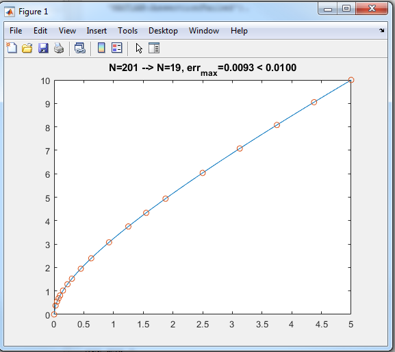

# MATLAB MISC
[https://github.com/danneedebro/Matlab_misc](https://github.com/danneedebro/Matlab_misc)

# CoarsenXYData
A MATLAB-function to coarsen a table (xy-data)

```
[x_coarse,y_coarse] = CoarsenXYData(x,y,tol)
```
returns `x_coarse`, and `y_coarse` that satisfies that a linear interpolation between this coarse representation reproduces `y` within the tolerance (i.e `interp1(x_coarse,y_coarse,x(i)) = y(i) +- tol`)


## Example
```
x = 0:0.025:5;
y = sqrt(5*x)+x;
tol=0.01;
[x_coarse,y_coarse] = CoarsenXYData(x,y,tol);
err_max = max(abs(interp1(x_coarse,y_coarse,x)-y));
plot(x,y,'-',x_coarse,y_coarse,'o')
title(sprintf('N=%d --> N=%d, err_m_a_x=%1.4f < %1.4f',length(x),length(x_coarse),err_max,tol))
```




